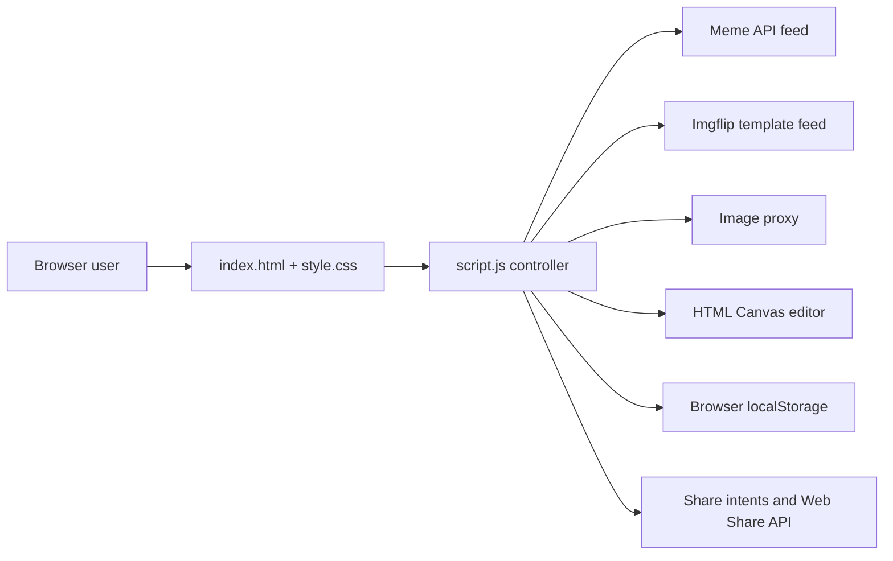

# MemeDrop

> A browser-first meme discovery and canvas editor for remixing fresh memes, exporting Story-sized images, and sharing the result.

[](https://github.com/vincenzo-afk/MemeDrop/actions/workflows/static-site-validation.yml)
[](LICENSE)
[](https://meme-drop.vercel.app)

[Live demo](https://meme-drop.vercel.app) · [Report a bug](https://github.com/vincenzo-afk/MemeDrop/issues/new?template=bug_report.yml) · [Request a feature](https://github.com/vincenzo-afk/MemeDrop/issues/new?template=feature_request.yml) · [Contributing](CONTRIBUTING.md)

---

## Table of contents

- [About](#about)
- [Technology and services](#technology-and-services)
- [Getting started](#getting-started)
- [Using MemeDrop](#using-memedrop)
- [Architecture](#architecture)
- [Project structure](#project-structure)
- [Features and roadmap](#features-and-roadmap)
- [Testing](#testing)
- [Deployment](#deployment)
- [Contributing](#contributing)
- [Security](#security)
- [License](#license)
- [Acknowledgements](#acknowledgements)

---

## About

MemeDrop is a **static, browser-only meme editor**. It retrieves fresh and subreddit-specific memes, presents title-derived discovery tags, and renders edits in an HTML `<canvas>`. Users can add custom text, stickers, filters, a second panel, and export-ready formats without creating an account or running an application server.

The application is designed for quick discovery and remixing. The current client supports direct X/Twitter, WhatsApp, and Reddit intent URLs, the Web Share API where a browser provides it, image and iframe embed snippets, local gallery persistence, and a 9:16 Story export. Meme feeds come from Meme API and Imgflip; the app uses an image proxy to improve canvas compatibility with remote images.[1] [2] [3]

| Area | Implemented behavior |
|---|---|
| Discovery | Fresh, trending, curated subreddit, custom subreddit, classic-template, title search, tag filters, and keyword heatmap |
| Editing | Canvas text, drag positioning, outline/shadow styles, colors, filters, emoji stickers, replacement images, and two-panel chains |
| GIFs | Animated GIF preview support in the editor through `libgif.js` / `SuperGif` when the source is accessible |
| Sharing | Copyable share URL, X/Twitter, WhatsApp, Reddit, browser-native sharing, and image or iframe embed code |
| Export | PNG download, Clipboard API copy attempt, Story-sized 540×960 export, and local gallery save |
| Persistence | Theme, local gallery, and derived tag cache stored in `localStorage` on the user’s device |

### Architecture



---

## Technology and services

| Category | Technology | Role |
|---|---|---|
| Frontend | HTML, CSS, vanilla JavaScript | Static interface, state, rendering, and interaction |
| Graphics | HTML Canvas 2D API | Meme composition, filters, text, stickers, and image export |
| Animation | `libgif.js` loaded from jsDelivr | Animated GIF frame playback on the canvas |
| Data | [Meme API](https://github.com/D3vd/Meme_Api) and [Imgflip API](https://api.imgflip.com/) | Reddit-sourced meme feed and classic meme templates |
| Browser platform | `localStorage`, Clipboard API, Web Share API, IntersectionObserver | Local persistence, sharing, and seamless loading |
| Image delivery | [images.weserv.nl](https://images.weserv.nl/) | Proxying remote source images before canvas use |
| Hosting | Static hosting | The repository includes no server-side runtime or build process |

MemeDrop has no package manifest, database, authentication layer, required environment variables, or bundled build step. A modern browser is sufficient to use it. Node.js is only needed for the repository’s syntax-validation command.

---

## Getting started

### Prerequisites

Use a modern desktop or mobile browser with JavaScript enabled. For local serving, use Python 3 or any static HTTP server. Internet access is needed for live feeds, web fonts, the image proxy, and GIF support.

### Run locally

```bash
git clone https://github.com/vincenzo-afk/MemeDrop.git
cd MemeDrop
python3 -m http.server 8080
```

Open `http://localhost:8080` in a browser. Serving through HTTP rather than opening `index.html` directly is recommended because sharing, remote images, and browser APIs behave more consistently in a served context.

### Configuration

There is no `.env` configuration. The live demo and a local clone both use the same public client-side source configuration:

| Integration | Source | Notes |
|---|---|---|
| Meme feed | `https://meme-api.com/gimme` | Supports the curated and custom subreddit views |
| Classic templates | `https://api.imgflip.com/get_memes` | Supplies the classic tab |
| GIF decoding | jsDelivr-hosted `libgif.js` | Loaded from `index.html` |

---

## Using MemeDrop

### Discover a meme

Use the top tabs for a curated feed or type a public subreddit name in the **Browse a subreddit** field. The keyword heatmap and tags are derived from loaded meme titles and cached in browser storage; they are not authoritative Reddit flair data.[1]

### Edit and export

Select a meme card to open the editor. Enter top and bottom text, choose a text style, add a filter or sticker, and drag text or stickers on the canvas. Use **Export Story 9:16** to create a 540×960 PNG, or use **Download PNG** for the current canvas size.

### Share and embed

The editor generates a share URL containing the selected source image and current text fields. Choose a network-specific button, the browser’s native share sheet, or **Embed** to copy an image or iframe snippet. Open Graph tags are synchronized in the active browser document; a static deployment uses the original source image as the preview fallback rather than a server-rendered Open Graph image.

---

## Project structure

```text
MemeDrop/
├── .github/
│   ├── ISSUE_TEMPLATE/        # Structured bug and feature issue forms
│   ├── workflows/             # Static-site validation workflow
│   ├── CODEOWNERS             # Verified repository ownership mapping
│   ├── dependabot.yml         # GitHub Actions update configuration
│   └── pull_request_template.md
├── docs/
│   ├── data-sources.md        # Feed, tag, and flair constraints
│   └── qa-smoke-test.md       # Browser smoke-test observations
├── index.html                 # UI structure and third-party script declarations
├── script.js                  # Data fetches, editing, sharing, storage, and UI state
├── style.css                  # Responsive visual system
├── CONTRIBUTING.md            # Contribution workflow
├── CODE_OF_CONDUCT.md         # Community standards
├── SECURITY.md                # Private vulnerability-reporting guidance
└── LICENSE                    # MIT License
```

---

## Features and roadmap

| Status | Scope |
|---|---|
| ✅ | Live meme and classic-template browsing |
| ✅ | Custom subreddit picker, title search, tags, and keyword heatmap |
| ✅ | Canvas editor with text, filters, stickers, replacement images, and two-panel chains |
| ✅ | GIF canvas preview and browser-local gallery |
| ✅ | PNG, Clipboard API, and Instagram Story-sized exports |
| ✅ | Social intent sharing, Web Share API fallback, and embed snippets |
| Planned | A deployable server-side Open Graph image renderer for crawler-visible previews |
| Planned | Automated cross-browser UI testing beyond static syntax validation |

See the [commit history](https://github.com/vincenzo-afk/MemeDrop/commits/main) for released changes and implementation details.

---

## Testing

The repository’s continuous integration workflow runs static validation on every push and pull request. Run the same core check locally with Node.js:

```bash
node --check script.js
```

For interaction coverage, serve the site locally and verify that a feed loads, the editor opens, an image exports, and a share or embed control produces a URL. The checked-in browser smoke-test notes record the feature scenarios already exercised during development.

---

## Deployment

MemeDrop is static and can be deployed to a static-hosting provider. The configured live homepage is [meme-drop.vercel.app](https://meme-drop.vercel.app). Deploy the repository root without a build command and use `index.html` as the entry document.

> **Important:** Full crawler-visible Open Graph image rendering requires a serverless or server-side image endpoint. The current static application updates metadata in the user’s browser and uses the source image as a safe preview fallback.

---

## Contributing

Contributions are welcome through issues and pull requests. Read [CONTRIBUTING.md](CONTRIBUTING.md) for setup, validation, branch naming, commit, and review expectations. Community participation is governed by the [Code of Conduct](CODE_OF_CONDUCT.md).

---

## Security

Please do not disclose suspected vulnerabilities in public issues. Follow the private reporting path in [SECURITY.md](SECURITY.md). The repository enables GitHub secret scanning and push protection; the new dependency configuration also keeps GitHub Actions references under automated review.

---

## License

Distributed under the [MIT License](LICENSE).

---

## Acknowledgements

MemeDrop relies on Meme API for subreddit meme data, Imgflip for classic template data, `libgif.js` for GIF playback, and the browser APIs that make local-first editing practical.[1] [2] [3]

---

Built and maintained by [vincenzo-afk](https://github.com/vincenzo-afk). View the [live demo](https://meme-drop.vercel.app) or return to the [top](#memedrop).

## References

[1]: https://github.com/D3vd/Meme_Api "Meme API"
[2]: https://api.imgflip.com/ "Imgflip API"
[3]: https://github.com/buzzfeed/libgif-js "libgif.js"
